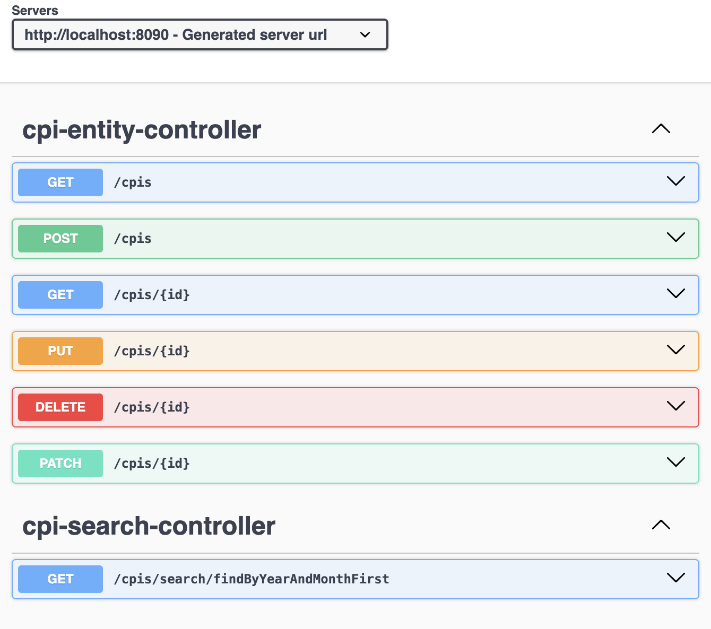

# CPI value
## _A Web Service in SpringBoot that provides the CPI value_

[](https://spring.io/projects/spring-boot)

[](https://travis-ci.org/joemccann/dillinger)

This Spring Boot application provides a web service that retrieves Consumer Price Index (CPI) values and notes for a specified month and year.
The service calls the Bureau of Labor Statistics (BLS) API to get the real CPI data and caches the results in an H2 database for subsequent requests.
This ensures the application stays within the API call limit.


# Implementation Logic

- Validates input
- Checks if there is a CIS data in the local-cache-db for the given year and month saved in the last 24 hrs
- If there is recent CIS data, it presents that data to the client.
- If there is no recent data, it requests the external BLS-WEB-SERVICE. It then saves the response in the local-cache-db for future reuests. And, also serves the request

# Building from source

Build the JAR file: Open a terminal or command prompt, navigate to the root directory of your project (where the build.gradle file is located), and run:

>gradle clean build


This command will compile your code, run tests, and package your application into a JAR file. The JAR file will be located in the build/libs directory by default.

Locate the JAR file: After the build completes, you can find the JAR file in the build/libs directory of your project. It will be named something like your-application-name-version.jar.

Running the JAR File
To run the JAR file, use the java -jar command:

>java -jar libs/CPI-0.0.1-SNAPSHOT.jar

A pre-built jar can be downloaded [here](https://github.com/mekete/repository/blob/main/resources/CPI-0.0.1-SNAPSHOT.jar).

## Accessing the service:

You can use the embedded swagger api docs:
```sh
http://localhost:8090/swagger-ui/index.html
```





As port 8080 may be used by most servlet containers, the default port is moved to 8090. You can, however, change the port by updating the value of `server.port` in the  `application.properties` file

```sh
server.port=8090
```

And you can run it
```sh
{localhost-or-ip}:{your-port}
```
If you want to change the port
## Tech stack

This sample uses a these open source libs:

Dillinger is currently extended with the following plugins.
Instructions on how to use them in your own application are linked below.

| Plugin | README |
| ------ | ------ |
| Swagger       | [Swagger Documentation](https://swagger.io/docs/) |
| Gradle        | [Gradle Documentation](https://docs.gradle.org/current/userguide/userguide.html) |
| Gson          | [Gson GitHub](https://github.com/google/gson) |
| H2 Database   | [H2 Database Documentation](https://www.h2database.com/html/main.html) |


### Reference Documentation

For further reference, please consider the following sections:

* [Official Gradle documentation](https://docs.gradle.org)
* [Spring Boot Gradle Plugin Reference Guide](https://docs.spring.io/spring-boot/3.3.2/gradle-plugin)
* [Create an OCI image](https://docs.spring.io/spring-boot/3.3.2/gradle-plugin/packaging-oci-image.html)
* [Spring Data JPA](https://docs.spring.io/spring-boot/docs/3.3.2/reference/htmlsingle/index.html#data.sql.jpa-and-spring-data)
* [Rest Repositories](https://docs.spring.io/spring-boot/docs/3.3.2/reference/htmlsingle/index.html#howto.data-access.exposing-spring-data-repositories-as-rest)
* [Spring Web](https://docs.spring.io/spring-boot/docs/3.3.2/reference/htmlsingle/index.html#web)

### Guides

The following guides illustrate how to use some features concretely:

* [Accessing Data with JPA](https://spring.io/guides/gs/accessing-data-jpa/)
* [Accessing JPA Data with REST](https://spring.io/guides/gs/accessing-data-rest/)
* [Accessing Neo4j Data with REST](https://spring.io/guides/gs/accessing-neo4j-data-rest/)
* [Accessing MongoDB Data with REST](https://spring.io/guides/gs/accessing-mongodb-data-rest/)
* [Building a RESTful Web Service](https://spring.io/guides/gs/rest-service/)
* [Serving Web Content with Spring MVC](https://spring.io/guides/gs/serving-web-content/)
* [Building REST services with Spring](https://spring.io/guides/tutorials/rest/)

### Additional Links

These additional references should also help you:

* [Gradle Build Scans – insights for your project's build](https://scans.gradle.com#gradle)

